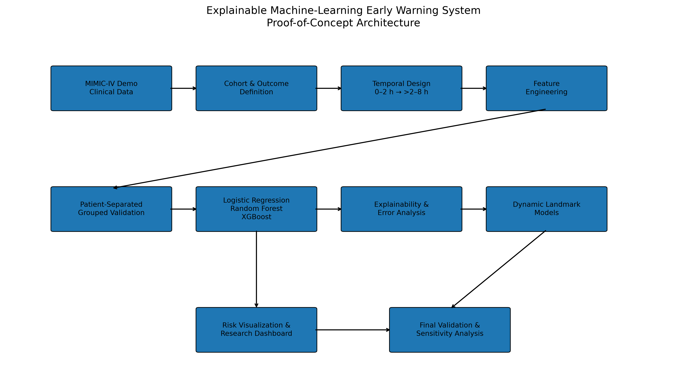
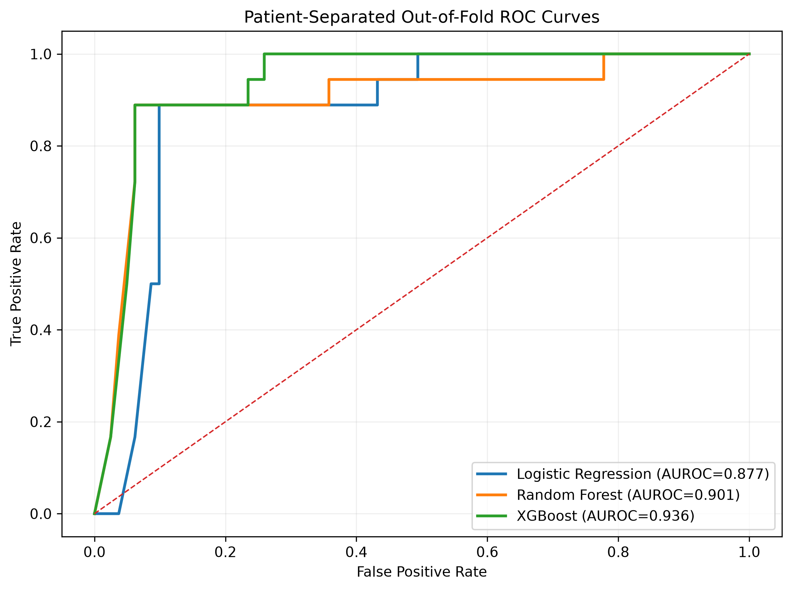
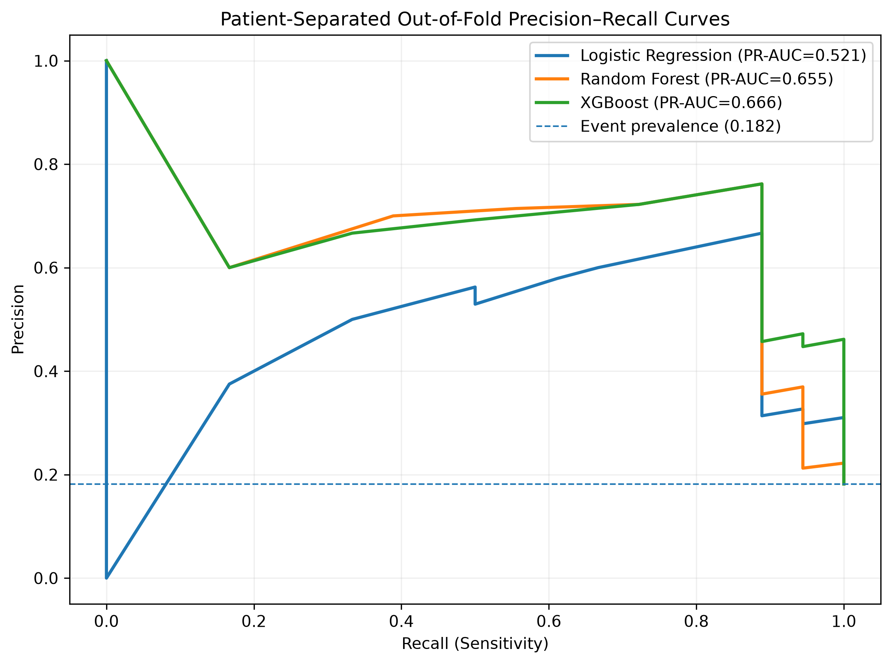
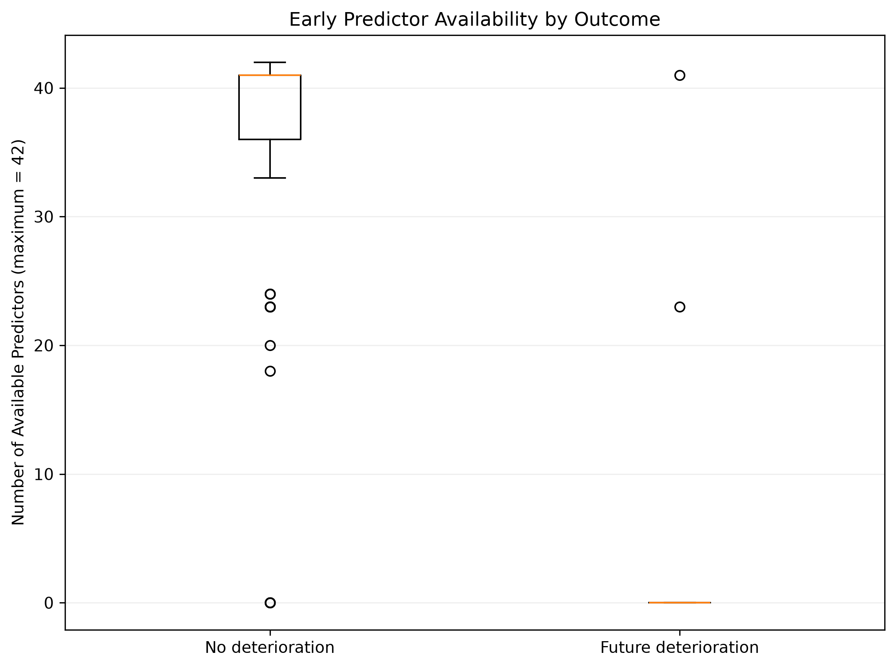
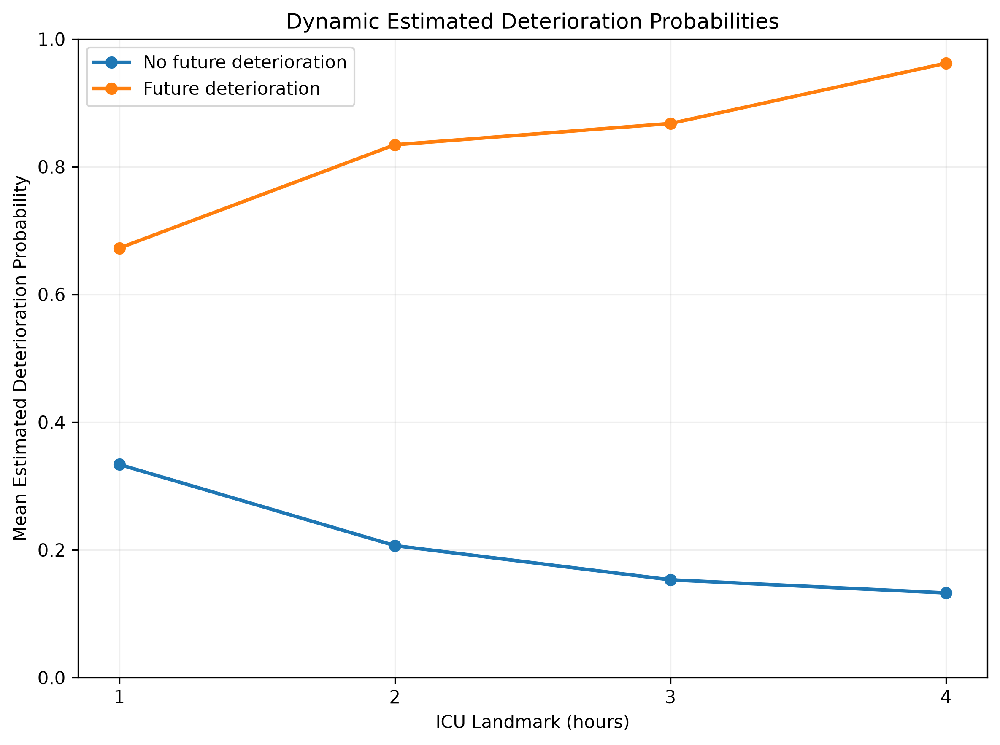

# ICU Deterioration Early-Warning System

### An Explainable Machine-Learning Proof-of-Concept Using MIMIC-IV Demo

An end-to-end health-AI project exploring whether routinely collected early ICU data can be used to estimate short-term clinical deterioration.

The project covers the complete workflow from **EHR data exploration and temporal cohort design to machine-learning validation, explainability, dynamic prediction, data-quality auditing, and an interactive Streamlit dashboard**.

> **Research and educational use only:** This is a proof-of-concept developed using the MIMIC-IV Demo dataset. The models have not undergone external or prospective clinical validation and must not be used for clinical decision-making.

---

## 🏥 Clinical Problem

Early recognition of deterioration in critically ill patients is an important challenge in intensive care.

This project investigates the question:

> **Can information available during the first two hours of an ICU stay help identify patients who will deteriorate during the subsequent six hours?**

For this proof-of-concept, clinical deterioration was defined as the first occurrence of:

* new invasive mechanical ventilation,
* new vasopressor initiation, or
* ICU death.

The primary temporal design was:

**Observation:** ICU admission → 2 hours
**Prediction:** >2 hours → 8 hours

This separation was designed to reduce temporal leakage between predictor measurement and outcome occurrence.

---

## 🧠 Project Architecture



The workflow includes:

**MIMIC-IV Demo → Cohort Definition → Temporal Feature Engineering → Exploratory Analysis → Machine Learning → Patient-Separated Validation → Explainability & Error Analysis → Dynamic Prediction → Validation Audit → Streamlit Dashboard**

---

## 📊 Dataset

This project uses the **MIMIC-IV Demo** dataset.

The final primary analytic cohort contained:

| Characteristic          |      Value |
| ----------------------- | ---------: |
| ICU stays               |         99 |
| Unique patients         |         79 |
| Deterioration events    |         18 |
| Non-deterioration stays |         81 |
| Event prevalence        |      18.2% |
| Observation window      |  0–2 hours |
| Prediction window       | >2–8 hours |
| Engineered predictors   |         42 |

Raw MIMIC data are **not included in this repository**.

Users wishing to reproduce the project should obtain the MIMIC-IV Demo data through the appropriate PhysioNet/MIMIC access route and place the required files in the local `data/` directory.

---

## 🔬 Clinical Variables

Early physiological variables explored included:

* Heart rate
* Respiratory rate
* Oxygen saturation (SpO₂)
* Systolic blood pressure
* Diastolic blood pressure
* Mean arterial pressure
* Temperature

Laboratory variables were also explored during feature development.

For each variable, temporal summary features such as the following were generated when appropriate:

* mean
* minimum
* maximum
* standard deviation
* most recent value
* measurement count

Only information occurring within the specified observation period was eligible for model input.

---

## ⏱️ Temporal Prediction Design

Clinical machine-learning projects are particularly vulnerable to **data leakage**.

To reduce this risk, predictors and outcomes were explicitly separated in time.

```text
ICU Admission
     │
     │  Predictor observation
     │
     ▼
   0 ───────────── 2 h
                    │
                    │  Prediction period
                    ▼
                  >2 h ───────────── 8 h
```

Patients who had already deteriorated before the landmark were not treated as future deterioration cases.

---

## ⚙️ Feature Engineering

The final primary dataset contained **42 candidate predictors** derived from the early observation window.

Feature engineering included:

* temporal filtering,
* physiological summary statistics,
* most recent measurements,
* measurement-frequency features,
* missing-data handling within ML pipelines,
* leakage checks,
* and preservation of patient/stay identifiers for grouped validation.

No outcome information was intentionally included as a predictor.

---

## 🤖 Machine-Learning Models

Three models were evaluated:

1. **Logistic Regression**
2. **Random Forest**
3. **XGBoost**

Logistic Regression provided an interpretable baseline, while the tree-based models allowed exploration of nonlinear relationships.

Model preprocessing was performed within the modeling pipeline where appropriate.

---

## 🔒 Patient-Separated Validation

A central design requirement was preventing the same patient from appearing in both training and validation data.

Models were therefore evaluated using **patient-grouped cross-validation**, with:

```python
groups = subject_id
```

This prevents repeated ICU stays belonging to the same patient from leaking across validation boundaries.

The grouped comparison used **5-fold StratifiedGroupKFold** validation.

---

## 📈 Exploratory Model Performance

Patient-separated out-of-fold performance was:

| Model               |     AUROC |    PR-AUC | Sensitivity | Specificity | Brier Score |
| ------------------- | --------: | --------: | ----------: | ----------: | ----------: |
| Logistic Regression |     0.877 |     0.521 |       0.889 |       0.802 |       0.132 |
| Random Forest       |     0.901 |     0.655 |       0.889 |       0.938 |       0.085 |
| XGBoost             | **0.936** | **0.666** |       0.889 |       0.938 |   **0.061** |

XGBoost showed the highest **observed** pooled out-of-fold AUROC and PR-AUC in this small proof-of-concept cohort.

These values should **not** be interpreted as estimates of clinical deployment performance.

### ROC Curves



### Precision–Recall Curves



---

## 🚨 Error Analysis

Performance was evaluated beyond AUROC alone.

| Model               | TP | FP | FN | TN | False Alerts / True Alert |
| ------------------- | -: | -: | -: | -: | ------------------------: |
| Logistic Regression | 16 | 16 |  2 | 65 |                     1.000 |
| Random Forest       | 16 |  5 |  2 | 76 |                     0.313 |
| XGBoost             | 16 |  5 |  2 | 76 |                     0.313 |

In this dataset, Random Forest and XGBoost produced fewer false-positive classifications than Logistic Regression while identifying the same number of positive cases at the evaluated classification threshold.

The threshold used here is analytical and has **not** been optimized or validated as a clinical alert threshold.

---

## 🔍 Explainability

Model interpretation included:

* Logistic Regression coefficients,
* Random Forest feature importance,
* feature-family interpretation,
* false-positive analysis,
* false-negative analysis,
* and measurement-frequency features.

Several highly ranked features belonged to correlated physiological feature families.

Measurement-count variables also appeared among influential predictors, suggesting that **patterns of clinical measurement and data availability may themselves contain predictive information**.

Feature importance is interpreted as **predictive association**, not causation.

---

## ⚠️ Important Validation Finding: Predictor Availability

One of the most important findings emerged during the final model audit.

Among the **18 genuine future deterioration cases**:

> **16 of 18 (88.9%) had zero selected physiological predictors available during the 0–2-hour observation window.**

The outcome labels were independently rechecked:

* 99/99 cohort labels aligned correctly,
* all 18 positive cases had documented qualifying event times,
* all occurred after 2 hours and within the 8-hour prediction boundary.

Therefore, the finding was not explained by a target-label alignment error.

Early predictor availability was substantially different between deterioration and non-deterioration stays.



### Why this matters

A model can potentially learn patterns associated with **whether data were recorded**, rather than only learning physiological deterioration patterns.

Consequently, the strong outcome-dependent data availability observed in this small MIMIC-IV Demo cohort may materially contribute to the apparent discrimination of the models.

For this reason, all performance results in this repository are presented as **exploratory proof-of-concept findings**.

This audit is intentionally retained in the project rather than excluding featureless positive cases post hoc.

---

## 🕐 Dynamic Deterioration Prediction

In addition to the fixed 2-hour model, an exploratory dynamic prediction pipeline was implemented.

Predictions were generated at:

* 1 hour
* 2 hours
* 3 hours
* 4 hours

Each landmark predicted deterioration during the following six-hour period while using only information available up to that landmark.

| Landmark | ICU Stays | Patients | Future Events | Event Rate |
| -------- | --------: | -------: | ------------: | ---------: |
| 1 h      |       108 |       83 |            27 |      25.0% |
| 2 h      |        99 |       79 |            18 |      18.2% |
| 3 h      |        89 |       71 |             9 |      10.1% |
| 4 h      |        86 |       68 |             7 |       8.1% |

Later landmark cohorts contain fewer events because patients who deteriorated earlier are removed from subsequent eligible risk sets.



These values are referred to as **dynamic estimated deterioration probabilities**, not validated clinical risk scores.

---

## 🖥️ Interactive Streamlit Dashboard

A Streamlit application was developed to demonstrate how the analytical pipeline could be presented as a health-tech prototype.

The dashboard provides:

* ICU stay selection,
* dynamic estimated deterioration probability visualization,
* landmark history,
* fixed 2-hour model output,
* physiological feature summaries,
* observed outcome information,
* and explicit research-use limitations.

### Dashboard Preview


Run locally with:

```bash
streamlit run dashboard/app.py
```

> The dashboard is a research demonstration and is not intended to provide clinical recommendations.

---

## 🧪 Evaluation Metrics

Model evaluation included:

* AUROC
* Precision–Recall AUC
* Balanced Accuracy
* Sensitivity
* Specificity
* Brier Score
* False-positive counts
* False-negative counts
* False alerts per true alert
* Threshold sensitivity

This broader evaluation was chosen because discrimination alone is insufficient for assessing an early-warning model.

---

## 🛡️ Responsible Health-AI Design

Several safeguards were incorporated into the workflow:

### Temporal leakage prevention

Predictors were restricted to information available before the prediction period.

### Patient-level separation

Validation was grouped using `subject_id`.

### Error analysis

False positives and false negatives were explicitly examined.

### Missing-data audit

Predictor availability was compared between outcome groups.

### Calibration-related evaluation

Brier scores were reported alongside discrimination metrics.

### No causal interpretation

Feature importance was treated as predictive rather than causal.

### No clinical threshold claims

Classification thresholds were not presented as clinically optimized alert thresholds.

### Transparent limitations

Unexpected data-quality findings were retained and reported rather than removed to improve model performance.

---

## 🛠️ Technology Stack

**Language**

* Python

**Data Analysis**

* pandas
* NumPy

**Machine Learning**

* scikit-learn
* XGBoost

**Visualization**

* Matplotlib

**Application**

* Streamlit

**Development**

* Jupyter Notebook
* VS Code
* Git / GitHub

**Dataset**

* MIMIC-IV Demo

---

## 📁 Repository Structure

```text
mimic-icu-deterioration-ai/
│
├── README.md
├── requirements.txt
├── .gitignore
│
├── notebooks/
│   ├── data exploration
│   ├── outcome definition
│   ├── temporal design
│   ├── feature engineering
│   ├── exploratory analysis
│   ├── model development
│   ├── grouped model comparison
│   ├── explainability and error analysis
│   ├── dynamic prediction
│   ├── final validation
│   └── final figures and tables
│
├── dashboard/
│   └── app.py
│
├── figures/
│   ├── figure1_roc_curves.png
│   ├── figure2_precision_recall_curves.png
│   ├── figure3_model_performance.png
│   ├── figure4_dynamic_probabilities.png
│   ├── figure5_predictor_availability.png
│   ├── figure6_system_architecture.png
│   ├── dashboard_overview.png
│   └── dashboard_dynamic_trajectory.png
│
├── results/
│   └── summary tables and model outputs
│
├── src/
│
└── data/                  # Local only — excluded from Git
```

---

## 🚀 Running the Project

### 1. Clone the repository

```bash
git clone <repository-url>
cd mimic-icu-deterioration-ai
```

### 2. Create a virtual environment

Windows:

```bash
python -m venv .venv
.venv\Scripts\activate
```

macOS/Linux:

```bash
python3 -m venv .venv
source .venv/bin/activate
```

### 3. Install dependencies

```bash
pip install -r requirements.txt
```

### 4. Obtain the data

Download/access the required MIMIC-IV Demo files separately and place them under the local:

```text
data/
```

directory.

Raw MIMIC data are intentionally excluded from version control.

### 5. Run the notebooks

Launch Jupyter:

```bash
jupyter notebook
```

The notebooks document the pipeline from data exploration through final validation.

### 6. Launch the dashboard

```bash
streamlit run dashboard/app.py
```

---

## 📌 Key Limitations

This project has several important limitations:

1. **Small dataset** — MIMIC-IV Demo is substantially smaller than the full MIMIC-IV database.
2. **Only 18 primary outcome events** were present in the final 2-hour cohort.
3. **Strong outcome-dependent predictor availability** was identified.
4. **16/18 deterioration cases had no selected physiological predictors available during the primary observation window.**
5. Later dynamic landmarks contained very few future events.
6. Multiple engineered summaries from the same physiological variables are correlated.
7. Validation was internal and patient-separated but not external or prospective.
8. No classification threshold has been clinically optimized.
9. The models have not been evaluated for real-world safety, workflow integration, fairness, or clinical utility.

---

## 💡 What This Project Demonstrates

This repository is intended primarily as a **health-tech and clinical-AI portfolio project**.

It demonstrates experience with:

* clinical problem formulation,
* longitudinal EHR data,
* MIMIC relational data structures,
* temporal prediction problems,
* clinically informed outcome definition,
* feature engineering,
* missing-data analysis,
* leakage-aware machine learning,
* patient-level grouped cross-validation,
* Logistic Regression,
* Random Forest,
* XGBoost,
* model discrimination and probability evaluation,
* explainability,
* error analysis,
* dynamic landmark modeling,
* responsible health-AI validation,
* Streamlit application development,
* and communicating ML limitations transparently.

---

## 🔮 Future Development

Potential next steps include:

* repeating the analysis using the full MIMIC-IV dataset,
* requiring or separately analyzing minimum early-data availability,
* evaluating missingness-aware modeling strategies,
* incorporating laboratory measurements and additional clinical variables,
* external validation,
* prospective temporal validation,
* formal probability calibration,
* clinically informed alert-threshold analysis,
* subgroup/fairness evaluation,
* and evaluating whether the system adds value over established clinical early-warning approaches.

More complex sequence models could also be explored with substantially larger datasets, but they were intentionally not emphasized in this small proof-of-concept cohort.

---

## ⚖️ Disclaimer

This repository is an **educational and research proof-of-concept**.

It is **not a medical device**, has not been clinically validated, and must not be used to diagnose, monitor, treat, or make decisions about individual patients.

Model outputs represent experimental machine-learning estimates generated from retrospective data.

---
**LICENSE**
 Project source code is released under the MIT License. MIMIC-IV/MIMIC-IV Demo data are not distributed with this repository and remain subject to their applicable PhysioNet/MIMIC terms and conditions

## 👤 Author

**Harikrishnan Nair S**

MBBS Final-Year Student | Health-Tech & Clinical AI

Interested in the intersection of **medicine, machine learning, clinical data science, and digital health**.

---

## ⭐ Project Summary

This project demonstrates not only how an ICU deterioration model can be built, but also why **clinical-AI validation must go beyond model performance metrics**.

The most important lesson from the project was that an apparently strong model can still contain important data-quality signals that substantially affect interpretation.

In health AI, finding and reporting those limitations is part of building the model responsibly.
